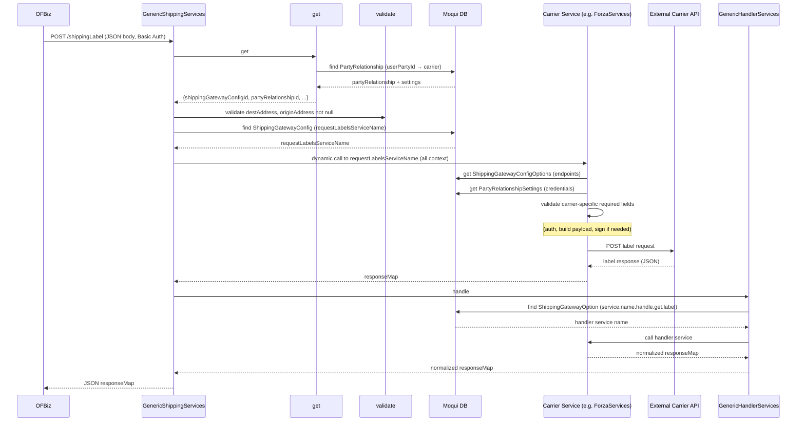
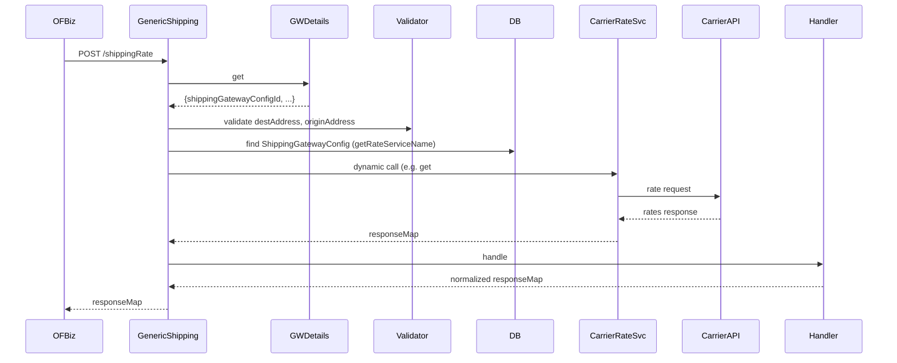

import Tabs from '@theme/Tabs';
import TabItem from '@theme/TabItem';
import Admonition from '@theme/Admonition';
import DownloadPdfWrapper from '@site/src/components/DownloadPdfWrapper';
import CarrierSimulator from '@site/src/components/CarrierSimulator';

# Shipping Aggregator — Complete Architecture & Functional Reference

<DownloadPdfWrapper />

:::info Interactive Guide
This architectural document includes interactive components like the Carrier Payload Simulator and tabbed code blocks to help you understand the integration boundary.
:::

<div id="printable-content">

> **Scope**: Moqui `shipping-aggregator` component as deployed in ADOC  
> **Last updated**: 2026-02-20  
> **Primary source**: `moqui-copy/moqui-framework/runtime/component/shipping-aggregator/`

---

## Table of Contents

1. [System Overview](#1-system-overview)
2. [Moqui ↔ OFBiz Integration Boundary](#2-moqui--ofbiz-integration-boundary)
3. [Core Architecture: The Plugin Pattern](#3-core-architecture-the-plugin-pattern)
4. [Entity Model & Configuration Data](#4-entity-model--configuration-data)
5. [REST API Surface](#5-rest-api-surface)
6. [Authentication & Token Management](#6-authentication--token-management)
7. [Label Generation — Full Lifecycle](#7-label-generation--full-lifecycle)
8. [Rate Shopping — Full Lifecycle](#8-rate-shopping--full-lifecycle)
9. [Label Voiding (Refund) — Full Lifecycle](#9-label-voiding-refund--full-lifecycle)
10. [Webhook / Order Status Callback](#10-webhook--order-status-callback)
11. [Carrier Integration Details](#11-carrier-integration-details)
12. [Error Handling & Logging](#12-error-handling--logging)
13. [Configuration Reference](#13-configuration-reference)

---

## 1. System Overview

The **Shipping Aggregator** is a Moqui framework component that acts as a **carrier-agnostic shipping gateway hub**. It receives shipping requests from OFBiz OMS (via REST HTTP calls), resolves the correct carrier and configuration from the requesting user's identity, then invokes a carrier-specific implementation, normalizes the response, and returns it to OFBiz.

```
┌───────────────────────┐         HTTP REST          ┌────────────────────────────────────────────┐
│                       │ ─────────────────────────► │   Moqui: shipping-aggregator component     │
│   OFBiz OMS           │                            │                                            │
│  (order management,   │ ◄───────────────────────── │  ┌──────────────────────────────────────┐  │
│   fulfillment,        │    JSON response map        │  │ GenericShippingServices.xml           │  │
│   label printing)     │                            │  │  - get#ShippingRate                  │  │
│                       │                            │  │  - request#ShippingLabel             │  │
└───────────────────────┘                            │  │  - refund#ShippingLabel              │  │
                                                     │  │  - get#Manifest                      │  │
                                                     │  │  - post#Order / delete#Order         │  │
                                                     │  │  - get#Departments / Municipalities  │  │
                                                     │  │  - post#OrderStatus (webhook in)     │  │
                                                     │  └──────────────────────────────────────┘  │
                                                     │                    │                       │
                                                     │                    ▼                       │
                                                     │  ┌──────────────────────────────────────┐  │
                                                     │  │ get#ShippingGatewayDetails           │  │
                                                     │  │ (resolves carrier from user identity)│  │
                                                     │  └──────────────────────────────────────┘  │
                                                     │                    │                       │
                                                     │         ┌──────────▼────────────┐          │
                                                     │         │  Carrier Service       │          │
                                                     │         │ (dynamic dispatch via  │          │
                                                     │         │  ShippingGatewayConfig)│          │
                                                     │         └──────────┬────────────┘          │
                                                     │                    │                       │
                                                     │         ┌──────────▼────────────┐          │
                                                     │         │  GenericHandlerService │          │
                                                     │         │ (optional normalizer)  │          │
                                                     │         └───────────────────────┘          │
                                                     └────────────────────────────────────────────┘
                                                                          │
                                        ┌────────────┬────────────────────┼──────────────┐
                                        ▼            ▼                    ▼              ▼
                                     FORZA         C807           TERMINAL_EXPRESS    MOOVIN / DRIVIN / etc.
                                  (Guatemala)   (Honduras,SV)    (Costa Rica)        (other carriers)
```

### Key Design Decisions

| Decision | Implementation |
|----------|---------------|
| **Carrier routing** | Based on user's `partyId` → `PartyRelationship` → `ShippingGatewayConfigId` setting |
| **Service dispatch** | Dynamic — service names stored in DB (`ShippingGatewayConfig`, `ShippingGatewayOption`) |
| **Authentication** | Centralized `get#Token` with distributed cache (no re-auth per request) |
| **Response normalization** | Optional per-carrier handler via `ShippingGatewayOption` (`service.name.handle.get.label`, etc.) |
| **Multi-tenancy** | Each tenant (ADOC, ADOC_HN, ADOC_SV) has separate `PartyRelationship` and settings |

---

## 2. Moqui ↔ OFBiz Integration Boundary

OFBiz and Moqui are **separate applications** that communicate over HTTP REST. OFBiz acts as the API consumer; Moqui acts as the shipping service provider.

### How OFBiz Calls Moqui

OFBiz constructs a REST `POST` request with a JSON body and an `Authorization: Basic <base64>` header. The request is sent to one of Moqui's `shipping.rest.xml` endpoints.

**Authentication header**: OFBiz authenticates using Moqui user credentials. Each ADOC instance has a dedicated Moqui `UserAccount` (e.g., `adoc`, `adochn`, `adocsv`) whose `partyId` determines the carrier lookup.

**Key Moqui user accounts per instance:**

| Moqui UserAccount | Username | Party ID  | Instance           |
|-------------------|----------|-----------|--------------------|
| `ADOC`            | `adoc`   | `ADOC`    | Guatemala/main      |
| `ADOC_HN`         | `adochn` | `ADOC_HN` | Honduras           |
| `ADOC_SV`         | `adocsv` | `ADOC_SV` | El Salvador        |

:::danger Critical Identity Logic
The `partyId` of the logged-in Moqui user is the anchor for all carrier resolution. This is set at the time of the REST call via the `Authorization` header.
:::

### Data OFBiz Sends to Moqui

OFBiz enriches the request with data pulled from its own entities:

| Field Category | Fields Sent | Source in OFBiz |
|----------------|-------------|-----------------|
| **Origin address** | `toName`, `address1`, `address2`, `city`, `stateOrProvinceCode`, `countryCode`, `phoneNumber`, `emailAddress`, `warehouseId` | Facility postal address |
| **Destination address** | `toName`, `address1`, `address2`, `city`, `stateOrProvinceCode`, `province`, `canton`, `district`, `countryCode`, `phoneNumber`, `emailAddress`, `stateName` | Order ship-to address + order attributes |
| **Parcels** | `weight`, `weightUnit`, `weightUomId`, `length`, `width`, `height`, `currency`, `fragile` | Shipment packages |
| **Order info** | `orderId`, `orderName`, `orderNumber`, `orderDate`, `ticketNumber`, `dateOfSale` | Order header |
| **Business rules** | `cod` (boolean), `validShipmentTotal`, `paymentStatusId`, `shipmentMethodTypeId` | Order payment + fulfillment |
| **Carrier hint** | `carrierPartyId` (optional) | Carrier assignment |

### Data Moqui Returns to OFBiz

Moqui always returns a `responseMap` JSON object. Successful responses include:

```json
{
  "success": true,
  "shippingLabelMap": {
    "referenceNumber": "123456",
    "packages": [
      { "trackingIdNumber": "TRK001" }
    ]
  },
  "artifacts": [ ... ]
}
```

Error responses:

```json
{
  "success": false,
  "errorMessages": "No carrier found"
}
```

---

## 3. Core Architecture: The Plugin Pattern

Every top-level generic service follows the **same 5-step pipeline**:

```
1. get#ShippingGatewayDetails   → Resolve carrier from user identity
2. validate#RequiredParameters  → Validate mandatory inputs
3. ShippingGatewayConfig lookup → Find the right carrier service name
4. Dynamic carrier service call → Invoke carrier-specific implementation
5. GenericHandlerServices call  → Optional carrier-specific response normalization
```

### Step 1 — `get#ShippingGatewayDetails`

This is the carrier resolution **keystone** service. It is `allow-remote="false"` (internal only).

```xml
<!-- Pseudocode of the logic -->
userPartyId = ec.user.userAccount.partyId  // from HTTP Basic Auth

if (carrierPartyId is null):
    lookup PartyRelationship WHERE:
        fromPartyId  = userPartyId
        fromRoleTypeId = "Client"
        toRoleTypeId   = "Carrier"
        relationshipTypeEnumId = "DefaultCarrier"
else:
    lookup PartyRelationship WHERE:
        fromPartyId  = userPartyId
        fromRoleTypeId = "Client"
        toPartyId    = carrierPartyId
        toRoleTypeId   = "Carrier"
        relationshipTypeEnumId = "ClientCarrier"

lookup PartyRelationshipSetting WHERE:
    partyRelationshipId = partyRelationship.partyRelationshipId
    partySettingTypeId  = "ShippingGatewayConfigId"

return: {
  success: true,
  userPartyId, carrierPartyId,
  partyRelationshipId,
  shippingGatewayConfigId: partyRelationshipSetting.settingValue
}
```

**Entity flow diagram:**

```
UserAccount.partyId
       │
       ▼
PartyRelationship  ──────────────────────────────────────────────────────────────────────────────────
  fromPartyId = userPartyId (Client role)                                                          │
  toPartyId   = carrierPartyId (Carrier role)                                                      │
  relationshipTypeEnumId = "ClientCarrier" (or "DefaultCarrier")                                  │
       │                                                                                           │
       ▼                        yields partyRelationshipId                                         │
PartyRelationshipSetting                                                                           │
  partySettingTypeId = "ShippingGatewayConfigId"                                                  │
  settingValue = "FORZA" / "C807" / "TERMINAL_EXPRESS" / ...         ──────────────────────────────┘
       │
       ▼
ShippingGatewayConfig.shippingGatewayConfigId = settingValue
```

### Step 3 — Service Name Resolution via ShippingGatewayConfig

For **label requests**, the service name comes from `ShippingGatewayConfig.requestLabelsServiceName`:
```xml
<ShippingGatewayConfig shippingGatewayConfigId="FORZA"
  requestLabelsServiceName="co.hotwax.shippingAggregator.forza.ForzaServices.request#ForzaShippingLabel"
  getRateServiceName="co.hotwax.shippingAggregator.forza.ForzaServices.get#ForzaShippingRate"
  refundLabelsServiceName="co.hotwax.shippingAggregator.forza.ForzaServices.refund#ForzaShippingLabel"/>
```

For **extended operations** (manifest, postOrder, deleteOrder, departments, municipalities), the service name comes from `ShippingGatewayOption`:
```xml
<ShippingGatewayOption
  shippingGatewayConfigId="C807"
  optionEnumId="service.name.get.manifest"
  optionValue="co.hotwax.shippingAggregator.c807.C807Services.get#C807Manifest"/>
```

### Step 4 — Dynamic Dispatch

Moqui's service engine resolves service names at runtime:
```xml
<service-call name="${shippingGatewayConfig.requestLabelsServiceName}" out-map="responseMap" in-map="context"/>
```

The entire `context` (all input parameters) is passed through to the carrier service. No filtering — carriers pick what they need.

### Step 5 — Handler Normalization

After the carrier call completes, a **handler service** is optionally invoked using a `ShippingGatewayOption`:

| Handler Option Enum | Purpose |
|--------------------|---------|
| `service.name.handle.get.label` | Normalizes label response |
| `service.name.handle.get.rate` | Normalizes rate response |
| `service.name.handle.void.label` | Normalizes void response |
| `service.name.handle.post.order` | Normalizes post-order response |
| `service.name.handle.delete.order` | Normalizes delete-order response |
| `service.name.handle.get.manifest` | Normalizes manifest response |
| `service.name.handle.get.departments` | Normalizes departments response |
| `service.name.handle.get.municipalities` | Normalizes municipalities response |
| `service.name.handle.webhook.response` | Handles inbound carrier webhook |

If no handler option is configured, the raw carrier response is returned as-is.

---

## 4. Entity Model & Configuration Data

### Core Mantle Entities Used

| Entity | Key Fields | Purpose |
|--------|-----------|---------|
| `mantle.party.Party` | `partyId`, `partyTypeEnumId` | Represents clients (ADOC) and carriers (FORZA, C807, etc.) |
| `mantle.party.PartyRelationship` | `fromPartyId`, `toPartyId`, `relationshipTypeEnumId`, `partyRelationshipId` | Links a client party to a carrier party |
| `mantle.party.PartyRelationshipSetting` | `partyRelationshipId`, `partySettingTypeId`, `settingValue` | Stores per-relationship credential/config key-value pairs |
| `mantle.shipment.carrier.ShippingGatewayConfig` | `shippingGatewayConfigId`, `requestLabelsServiceName`, `getRateServiceName`, `refundLabelsServiceName` | Maps a carrier config ID to its service implementations |
| `mantle.shipment.carrier.ShippingGatewayOption` | `shippingGatewayConfigId`, `optionEnumId`, `optionValue` | Stores carrier-specific endpoint URLs and handler service names |
| `mantle.shipment.carrier.ShippingGatewayCarrier` | `shippingGatewayConfigId`, `carrierPartyId` | Links a gateway config to a carrier party (used for token cache key) |
| `moqui.security.UserAccount` | `userId`, `username`, `partyId` | Moqui user that represents each OFBiz tenant instance |

### `PartySettingType` Values

These are the keys used in `PartyRelationshipSetting`. Each is loaded by `TypeData.xml`:

| Setting Key | Description | Used By |
|-------------|-------------|---------|
| `ShippingGatewayConfigId` | **Required** — resolves which gateway config to use | All carriers |
| `Username` | API username | C807, TerminalExpress, Moovin |
| `Password` | API password | C807, TerminalExpress, Moovin |
| `ClientId` | API client ID | C807, TerminalExpress, Forza, CargoTrans |
| `ClientSecretKey` | OAuth2 client secret or HMAC key | Forza, CargoTrans |
| `CodApp` | Forza-specific "app" identifier | Forza |
| `AccountNumber` | Carrier account number | Forza |
| `CodeOfReference` | Default facility code (overridable by `facilityIdentification`) | Forza |
| `ReverseLogistics` | Y/N flag for return shipment | TerminalExpress |
| `ApiKey` | Raw API key | CitiExpress |
| `ApiToken` | Bearer-style token | Drivin |
| `EndPoint` | Override base URL for the carrier API | C807, (others optional) |
| `AuthType` | `BASIC_AUTH` or `OAUTH2` | Used by `get#Token` |
| `SendSharedSecretKey` | Refresh token for OAuth2 token refresh | OAuth2 flow |
| `ClientUrl` | OFBiz base URL (for webhook callback) | C807 (SV, HN) |
| `ClientOrderEndpoint` | OFBiz endpoint path for status callbacks | C807 (SV, HN) |
| `ClientAuthKey` | Base64 Basic auth for callback to OFBiz | C807 (SV, HN) |
| `LabelType` | Label format type | varies |
| `PaymentType` | Payment type code | varies |

### `ShippingGatewayOption` `optionEnumId` Values

These control endpoint URLs and extended service names:

| Option Enum ID | Typical Value Type | Example |
|----------------|--------------------|---------|
| `endPoint` | Base URL of carrier API | `https://api.forza.com/` |
| `endPoint.accessToken` | Token endpoint path | `/oauth/token` |
| `endPoint.shipment.rate` | Rate query path | `/rates` |
| `endPoint.shipments.labels` | Label creation path | `/labels` or `Paquetes/crearOrden/` |
| `endPoint.shipments.void` | Void label path | `/labels/{id}/void` |
| `endPoint.shipments.manifest` | Manifest path | `/manifests` |
| `endPoint.municipalities` | Municipality lookup path | `/municipalities` |
| `endPoint.departments` | Department lookup path | `/departments` |
| `endPoint.post.order` | Post order path | `/orders` |
| `endPoint.delete.order` | Delete order path | `/orders/{id}` |
| `service.name.handle.get.label` | Handler service for label response | `...handle#C807LabelResponseHandler` |
| `service.name.handle.get.rate` | Handler service for rate response | `...handle#ForzaRateResponseHandler` |
| `service.name.handle.void.label` | Handler service for void response | `...handle#C807VoidLabelResponseHandler` |
| `service.name.handle.webhook.response` | Handler for inbound webhooks | `...handle#C807WebhookResponseHandler` |
| `LabelRequestTemplate` | Template enum | FTL template path |

---

## 5. REST API Surface

File: `service/shipping.rest.xml`  
All endpoints use `require-authentication="anonymous-all"` — meaning OFBiz passes credentials via `Authorization: Basic <base64(user:pass)>`.

| HTTP Method | Path | Moqui Service |
|-------------|------|---------------|
| `POST` | `/rest/s1/shipping/shippingRate` | `GenericShippingServices.get#ShippingRate` |
| `POST` | `/rest/s1/shipping/shippingLabel` | `GenericShippingServices.request#ShippingLabel` |
| `POST` | `/rest/s1/shipping/manifest` | `GenericShippingServices.get#Manifest` |
| `POST` | `/rest/s1/shipping/refundShippingLabel` | `GenericShippingServices.refund#ShippingLabel` |
| `POST` | `/rest/s1/shipping/postOrder` | `GenericShippingServices.post#Order` |
| `POST` | `/rest/s1/shipping/deleteOrder` | `GenericShippingServices.delete#Order` |
| `POST` | `/rest/s1/shipping/getDepartments` | `GenericShippingServices.get#Departments` |
| `POST` | `/rest/s1/shipping/getMunicipalities` | `GenericShippingServices.get#Municipalities` |
| `POST` | `/rest/s1/shipping/orderStatus` | `GenericShippingServices.post#OrderStatus` |

Party REST (`party.rest.xml`): Standard Mantle party management endpoints (find/create parties, roles) — not shipping-specific.

---

## 6. Authentication & Token Management

### Overview

Carriers use different authentication mechanisms. The system centralizes token acquisition in `HelperServices.get#Token`.

### `get#Token` Flow

```
1. Check distributed cache:
   key = "${partyRelationshipId}_accessToken"
   cache name = carrierPartyId

2. Cache HIT + isRefresh=false → return cached token immediately (no API call)

3. Cache MISS or isRefresh=true:
   a. Load ShippingGatewayConfigOptions (endPoints) and PartyRelationshipSettings (credentials)
   b. Read settingsMap['AuthType']:
      - "BASIC_AUTH" → restClient.basicAuth(username, password)
      - otherwise (OAuth2):
          if SendSharedSecretKey present:
            grant_type=refresh_token, refresh_token=<SendSharedSecretKey>
          elif password present:
            grant_type=password, username=..., password=...
          else:
            grant_type=client_credentials, client_id=..., client_secret=...
   c. POST to: (settingsMap.EndPoint OR optionsMap.endPoint) + optionsMap['endPoint.accessToken']
   d. On 2xx: cache access_token in distributed cache (putIfAbsent)
   e. Return { success: true, access_token: "..." }
```

### Carrier Auth Patterns

<Tabs>
  <TabItem value="forza" label="Forza" default>
    **Auth Method:** HMAC-SHA256 signature (`LauValue` header) + Base64 payload encoding
    **Cache Strategy:** No token needed — signature computed per request
  </TabItem>
  <TabItem value="c807" label="C807">
    **Auth Method:** OAuth2 Bearer token
    **Cache Strategy:** Cached per `partyRelationshipId`
  </TabItem>
  <TabItem value="terminal" label="Terminal Express">
    **Auth Method:** HTTP Basic Auth (`username:password`)
    **Cache Strategy:** No token needed — sent per request
  </TabItem>
  <TabItem value="others" label="Moovin / Drivin / CitiExpress...">
    *   **Moovin**: OAuth2 or Basic Auth (Cached if OAuth2)
    *   **CitiExpress**: API Key in header (No token needed)
    *   **Drivin**: Bearer API Token (static) (Stored in `ApiToken` setting)
    *   **CargoTrans**: OAuth2 client_credentials (Cached)
  </TabItem>
</Tabs>

---

## 7. Label Generation — Full Lifecycle

### Entry Point

OFBiz POSTs to `/rest/s1/shipping/shippingLabel` with a JSON body containing shipment data.

### Required Input Fields

| Field | Type | Required | Source |
|-------|------|----------|--------|
| `originAddress.toName` | String | Yes | Facility name |
| `originAddress.address1` | String | Yes | Facility address |
| `originAddress.city` | String | Yes | Facility city |
| `originAddress.stateOrProvinceCode` | String | Yes (Forza) | Facility state code |
| `originAddress.countryCode` | String | Yes | Facility country |
| `originAddress.phoneNumber` | String | Yes (some) | Facility phone |
| `originAddress.warehouseId` | String | Yes (TerminalExpress) | Carrier warehouse ID |
| `destAddress.toName` | String | Yes | Customer name |
| `destAddress.address1` | String | Yes | Shipping address |
| `destAddress.city` | String | Yes | Customer city |
| `destAddress.stateOrProvinceCode` | String | Yes | State code |
| `destAddress.province` | String | Yes (TerminalExpress) | Province name |
| `destAddress.canton` | String | Yes (TerminalExpress) | Canton |
| `destAddress.district` | String | Yes (TerminalExpress) | District |
| `destAddress.phoneNumber` | String | Yes | Customer phone |
| `destAddress.emailAddress` | String | Rec. | Customer email |
| `destAddress.stateName` | String | Yes (C807) | State name for C807 lookup |
| `parcels` | List | Yes | Array of `{weight, weightUnit, length, width, height}` |
| `weightAmount` | Decimal | Yes | Total shipment weight |
| `dateOfSale` | String | Yes (most) | Shipment date (YYYY-MM-DD) |
| `orderId` | String | Optional | OFBiz order ID |
| `orderName` | String | Yes (C807) | Order reference name |
| `orderNumber` | String | Yes (Forza, digits only) | Carrier order number |
| `cod` | String "true"/"false" | Yes | Cash on delivery flag |
| `validShipmentTotal` | Decimal | COD only | COD amount |
| `paymentStatusId` | String | Yes (C807) | `PAYMENT_NOT_RECEIVED` etc. |
| `shipmentMethodTypeId` | String | Yes (C807) | `SHIP_TO_STORE` etc. |
| `facilityIdentification` | String | Optional | Overrides `CodeOfReference` |

### Complete Call Sequence



### Interactive Payload Simulator

Use the simulator below to explore how the Generic payload structures adapt into Custom Carrier payloads for a Label Request.

<CarrierSimulator />

### Per-Carrier Label Request Construction

#### Forza (Guatemala)

**Validation:**
- `shippingGatewayConfigId`, `dateOfSale`, `weightAmount`, `countryId`, `parcels`, `destAddress`, `originAddress` must be present
- `orderNumber` must be digits only
- `originAddress.stateOrProvinceCode` and `destAddress.stateOrProvinceCode` must be present

**Municipality resolution:**
1. Extract department code from `stateOrProvinceCode` (split on `-`, take index `[1]`)
2. Call `get#ForzaMunicipality(departmentHeaderCode, countryId, city)` for both origin and destination
3. Retrieve `HeaderCodeTownship` for each city

**Request payload (Base64-encoded, wrapped in `PayLoad`):**
```json
{
  "Method": "/<endPoint.shipments.labels value>",
  "Params": {
    "DateOfSale": "2026-02-20",
    "ContentDescription": "...",
    "from_address": { "name", "phone", "email", "address1", "headerCodeTownship", "city" },
    "to_address":   { "name", "phone", "email", "address1", "headerCodeTownship", "city" },
    "Parcels": [...],
    "Order_Number": "12345",
    "Ticket_Number": "...",
    "IdCountry": "GT",
    "CountPieces": 1,
    "CodeOfReference": "357506",
    "TotalWeight": 2.5,
    "TotalValue": 100.0,
    "Collected": false,
    "Currency": "USD",
    "COD": { "CashOnDelivery": false, "AmmountCashOnDelivery": 0, "CashOnDeliveryCurrency": "USD" }
  }
}
```

**Security**: HMAC-SHA256 signature of the full request map using `ClientSecretKey`, sent as `LauValue` header. Payload is Base64-encoded using `ShippingAggregatorHelper.mapToBase64(requestMap)`.

**Response decoding:** `ShippingAggregatorHelper.decodePayLoad(responseMap)` decodes the Base64 response.

---

#### C807 (Honduras, El Salvador)

**Authentication:** Bearer token via `get#Token` (OAuth2 password or client_credentials flow, cached per `partyRelationshipId`).

**Department/Municipality resolution:**
1. `get#C807MatchingDepartment(stateProvinceName)` → fuzzy-match against C807's department list → `departmentId`
2. `get#C807MatchingMunicipality(cityName, departmentId)` → `municipalityId`

**COD Logic:**
```groovy
if (cod == "true" && paymentStatusId == "PAYMENT_NOT_RECEIVED" && shipmentMethodTypeId != "SHIP_TO_STORE") {
    tipo_servicio = "CCE"
    monto_cce = validShipmentTotal
} else {
    tipo_servicio = "SER"
}
```

:::note STS Logic Override
**STS (Ship-To-Store) Orders always get `"SER"` (non-COD) regardless of payment status.**
:::

**Request payload:**
```json
{
  "recolecta_fecha": "2026-02-20 19:00",
  "tipo_entrega": "<shipmentMethod>",
  "provisional": false,
  "sede": "<facilityIdentification (optional)>",
  "guias": [{
    "orden": "<orderName>-<orderDate>",
    "nombre": "<destAddress.toName>",
    "direccion": "<address1>, <address2>",
    "telefono": "<phoneNumber>",
    "correo": "<emailAddress>",
    "departamento_id": 5,
    "municipio_id": 23,
    "tipo_servicio": "SER",
    "detalle": [{ "peso": 2.5, "contenido": "Package Weight", "unidad_medida": "LB" }]
  }]
}
```

**Artifact fetch:** After label creation, `get#C807Artifacts(trackingIds)` is called to retrieve the label PDF/image.

---

#### TerminalExpress (Costa Rica)

**Authentication:** HTTP Basic Auth (`username`, `password` from settings — per request, no token caching).

**Required fields in `destAddress`:** `phoneNumber`, `province`, `canton`, `district`, `toName`  
**Required in `originAddress`:** `warehouseId`

**Request payload:**
```json
{
  "PROVINCIA": "<destAddress.province>",
  "CANTON": "<destAddress.canton>",
  "DISTRITO": "<destAddress.district>",
  "PESO": 2.5,
  "CLIENTE_ID": "1506",
  "BODEGA_ID": "<originAddress.warehouseId>",
  "NOM_CLIENTE_FINAL": "<destAddress.toName>",
  "TEL_CLIENTE_FINAL": "<destAddress.phoneNumber>",
  "DIR_CLIENTE_FINAL": "<full address string>",
  "LOGISTICA_INVERSA": "N"
}
```

**Endpoint:** `POST {endPoint}{endPoint.shipments.labels}` → `https://sandboxlte.laterminalexpress.com/api/Paquetes/crearOrden/`

---

## 8. Rate Shopping — Full Lifecycle

### Entry Point

`POST /rest/s1/shipping/shippingRate`

### Required Input Fields

Same address fields as label generation, plus:
- `parcels` (with weight/dimensions)
- `weightAmount`
- `currencyUomId`

Optional:
- `shipmentMethod`, `packagingType`, `pickupType`, `locationId`, `includeAlternativeRates`

### Flow



### Notes on Rate Shopping

- **No rate aggregation across carriers** — each REST call targets a single carrier (determined by user's `PartyRelationship`)
- **Rate selection logic** is handled by OFBiz, not Moqui — Moqui returns available rates; OFBiz selects
- **Forza rate endpoint** uses same HMAC/Base64 pattern as labels
- Rate caching is **not implemented** in the current codebase — each call hits the carrier API live

---

## 9. Label Voiding (Refund) — Full Lifecycle

### Entry Point

`POST /rest/s1/shipping/refundShippingLabel`

### Required Input Fields

| Field | Required | Notes |
|-------|----------|-------|
| `trackingNumber` | Yes (validated) | The label tracking number to void |
| `trackingIds` | Optional (List) | For batch void |
| `carrierPartyId` | Optional | If not provided, uses `DefaultCarrier` |

### Flow

```
OFBiz → POST /refundShippingLabel
  → get#ShippingGatewayDetails (resolve carrier)
  → validate#RequiredParameters(['trackingNumber'])
  → find ShippingGatewayConfig (refundLabelsServiceName)
  → dynamic call to refundLabelsServiceName
      e.g. ForzaServices.refund#ForzaShippingLabel
      e.g. C807Services.refund#C807ShippingLabel
  → GenericHandlerServices.handle#VoidShippingLabel
      (looks up option: service.name.handle.void.label)
  → return responseMap to OFBiz
```

### Per-Carrier Void Notes

**Forza (`refundShippingLabel.groovy`):**
- Validates `shippingGatewayConfigId`, `partyRelationshipId`, `trackingNumber`
- Uses same HMAC-SHA256 authentication
- Calls `endPoint.shipments.void` endpoint
- Response decoded with `decodePayLoad`

**C807 (`refundShippingLabel.groovy`):**
- Validates `trackingNumber` and optional `trackingIds`
- Gets Bearer token via `get#Token`
- Calls C807's label cancellation endpoint
- Handler normalizes response via `handle#C807VoidLabelResponseHandler`

**Void eligibility:** Determined entirely by the carrier API — there is no time-window check in the Moqui layer. If the carrier returns an error (e.g., "label already shipped"), the error is propagated in `errorMessages`.

**Idempotency:** Not explicitly implemented — a second void call with the same tracking number is forwarded to the carrier API again. The carrier API is expected to handle duplicate void requests gracefully (typically by returning a success or "already voided" message).

**Financial adjustments:** Not handled by Moqui. OFBiz is responsible for any refund or financial reversal once it receives a successful void response.

---

## 10. Webhook / Order Status Callback

### Inbound Flow (Carrier → Moqui → OFBiz)

`POST /rest/s1/shipping/orderStatus`

This endpoint accepts delivery status updates pushed by carriers (e.g., C807 webhooks).

```
Carrier ──POST──► Moqui /orderStatus
                    │
                    ├── Read headers: Partyid, Carrierid
                    ├── Find PartyRelationship (validates client, carrier)
                    ├── Load settings: ShippingGatewayConfigId, ClientUrl, ClientOrderEndpoint, ClientAuthKey
                    ├── Look up option: service.name.handle.webhook.response
                    ├── Call handler service (parses carrier-specific webhook payload)
                    │     e.g. C807Services.handle#C807WebhookResponseHandler
                    │     → returns normalized responseMap
                    │
                    └── POST normalized responseMap to OFBiz:
                          URL = settingsMap.ClientUrl + settingsMap.ClientOrderEndpoint
                          Header: Authorization: Basic <ClientAuthKey>
                          Body: JSON responseMap
```

**Key data flow:**
- `Partyid` header → identifies the tenant (e.g., `ADOC_SV`)
- `Carrierid` header → identifies the carrier (e.g., `C807`)
- The webhook body is read raw via `ec.web.getRequestBodyText()`
- The response is forwarded to OFBiz at: `ClientUrl + ClientOrderEndpoint`
  - For ADOC_SV: `https://adoc-sv-uat.hotwax.io/api/service/orderDeliveryStatus`
  - For ADOC_HN: `https://adoc-hn-uat.hotwax.io/api/service/orderDeliveryStatus`

---

## 11. Carrier Integration Details

### Carrier Inventory

| Carrier ID | Display Name | Country | Auth | Rate | Label | Void | Manifest |
|------------|-------------|---------|------|------|-------|------|---------|
| `FORZA` | Forza | GT | HMAC+Base64 | ✅ | ✅ | ✅ | ❓ |
| `C807` | C807 | HN, SV | OAuth2 Bearer | ❌ | ✅ | ✅ | ✅ |
| `TERMINAL_EXPRESS` | Terminal Express | CR | Basic Auth | ❌ | ✅ | ❌ | ❌ |
| `MOOVIN` | Moovin | GT | Basic/OAuth2 | ❓ | ✅ | ❓ | ❓ |
| `DRIVIN` | Drivin | GT, SV | Static Bearer | ❓ | ✅ | ❓ | ❓ |
| `CARGOTRANS` | CargoTrans | GT | OAuth2 | ❓ | ✅ | ❓ | ❓ |
| `CITI_EXPRESS` | CitiExpress | - | API Key | ❓ | ✅ | ❓ | ❓ |

### ShippingGatewayConfig per Carrier

**Forza:**
```
shippingGatewayConfigId = "FORZA"
getRateServiceName = "co.hotwax.shippingAggregator.forza.ForzaServices.get#ForzaShippingRate"
requestLabelsServiceName = "co.hotwax.shippingAggregator.forza.ForzaServices.request#ForzaShippingLabel"
refundLabelsServiceName = "co.hotwax.shippingAggregator.forza.ForzaServices.refund#ForzaShippingLabel"

Options:
  endPoint = <Forza API base URL>
  endPoint.accessToken = <token endpoint path>
  endPoint.shipments.labels = <label path>
  endPoint.shipments.void = <void path>
  endPoint.shipment.rate = <rate path>
  service.name.handle.get.label = ForzaServices.handle#ForzaLabelResponseHandler
  service.name.handle.get.rate = ForzaServices.handle#ForzaRateResponseHandler
  service.name.handle.void.label = ForzaServices.handle#ForzaVoidLabelResponseHandler
```

**C807:**
```
shippingGatewayConfigId = "C807"
requestLabelsServiceName = "co.hotwax.shippingAggregator.c807.C807Services.request#C807ShippingLabel"
refundLabelsServiceName = "co.hotwax.shippingAggregator.c807.C807Services.refund#C807ShippingLabel"

Options:
  endPoint = <C807 API base URL>  (settingsMap.EndPoint per-relationship, OR optionsMap.endPoint)
  endPoint.accessToken = <token path>
  endPoint.shipments.labels = <label path>
  endPoint.shipments.void = <void path>
  endPoint.shipments.artifacts = <artifact/pdf path>
  service.name.handle.get.label = C807Services.handle#C807LabelResponseHandler
  service.name.handle.void.label = C807Services.handle#C807VoidLabelResponseHandler
  service.name.handle.webhook.response = C807Services.handle#C807WebhookResponseHandler
```

**TerminalExpress:**
```
shippingGatewayConfigId = "TERMINAL_EXPRESS"
requestLabelsServiceName = "co.hotwax.shippingAggregator.terminalExpress.TerminalExpressServices.request#TerminalExpressShippingLabel"

Options:
  endPoint = "https://sandboxlte.laterminalexpress.com/api/"
  endPoint.shipments.labels = "Paquetes/crearOrden/"
  service.name.handle.get.label = TerminalExpressServices.handle#TerminalExpressResponseHandler
```

**Moovin:**
```
shippingGatewayConfigId = "MOOVIN"
postOrderServiceName = "co.hotwax.shippingAggregator.moovin.MoovinServices.post#MoovinOrder"
deleteOrderServiceName = "co.hotwax.shippingAggregator.moovin.MoovinServices.delete#MoovinOrder"

Options:
  endPoint = <Moovin API base URL>
  endPoint.post.order = <post order path>
  service.name.handle.post.order = MoovinServices.handle#MoovinHandlePostOrder
  service.name.handle.delete.order = MoovinServices.handle#MoovinHandleDeleteOrder
  service.name.handle.get.rate = MoovinServices.handle#MoovinHandleRateResponse
```
*Note: Moovin uses the `postOrder`/`deleteOrder` paradigm instead of `requestShippingLabel`.*

**Drivin:**
```
shippingGatewayConfigId = "DRIVIN"
postOrderServiceName = "co.hotwax.shippingAggregator.drivIn.DrivInServices.post#DrivInpostOrder"
deleteOrderServiceName = "co.hotwax.shippingAggregator.drivIn.DrivInServices.delete#DrivInDeleteOrder"

Options:
  endPoint = <Drivin API base URL>
  endPoint.post.order = <post order path>
  service.name.handle.post.order = DrivInServices.handle#DrivInHandlePostOrder
  service.name.handle.delete.order = DrivInServices.handle#DrivInHandleDeleteOrder
```
*Note: Uses an `ApiToken` via the `X-API-Key` header and dynamically queries for a `schema_code` on post order.*

**CargoTrans:**
```
shippingGatewayConfigId = "CARGOTRANS"
getRateServiceName = "co.hotwax.shippingAggregator.cargoTrans.CargoTransServices.get#CargoTransShippingRate"
requestLabelsServiceName = "co.hotwax.shippingAggregator.cargoTrans.CargoTransServices.request#CargoTransShippingLabel"

Options:
  endPoint = <CargoTrans API base URL>
  endPoint.shipments.labels = <label creation path>
  businessCategory.default = <category ID>
  service.name.handle.get.label = CargoTransServices.handle#CargoTransLabelResponseHandler
  service.name.handle.get.rate = CargoTransServices.handle#CargoTransRateResponseHandler
```
*Note: Requires a `ClientId` parameter in the payload body and a `ClientSecretKey` for the `X-API-Key` auth header. Also queries for a `municipalityId`.*

**CitiExpress:**
```
shippingGatewayConfigId = "CITI_EXPRESS"
postOrderServiceName = "co.hotwax.shippingAggregator.citiExpress.CitiExpressServices.post#CitiExpressOrder"
deleteOrderServiceName = "co.hotwax.shippingAggregator.citiExpress.CitiExpressServices.delete#CitiExpressOrder"

Options:
  endPoint = <CitiExpress API base URL>
  endPoint.post.order = <post order path>
  service.name.handle.post.order = CitiExpressServices.handle#CitiExpressHandlePostOrder
  service.name.handle.delete.order = CitiExpressServices.handle#CitiExpressHandleDeleteOrder
```
*Note: Passes the `ApiKey` setting directly inside the JSON payload logic. Requires precise coordinate attributes (`job_pickup_latitude` / `longitude`).*

**FedEx:**
```
shippingGatewayConfigId = "FEDEX"
getRateServiceName = "co.hotwax.shippingAggregator.Fedex.FedexServices.get#FedexShippingRate"
requestLabelsServiceName = "co.hotwax.shippingAggregator.Fedex.FedexServices.request#FedexShippingLabel"
refundLabelsServiceName = "co.hotwax.shippingAggregator.Fedex.FedexServices.refund#FedexShippingLabel"

Options:
  endPoint = <FedEx API base URL>
  endPoint.accessToken = <token path>
  endPoint.shipments.labels = <label path>
  endPoint.shipment.rate = <rate path>
  service.name.handle.get.label = FedexServices.handle#FedexLabelResponseHandler
  service.name.handle.get.rate = FedexServices.handle#FedexRateResponseHandler
  service.name.handle.void.label = FedexServices.handle#FedexVoidLabelResponseHandler
```
*Note: Implements standard OAuth2 (`client_credentials`) and caches the `accessToken`. Distinct from others, deeply standardized shipping fields (e.g. `LabelStockType`, dimensional units).*


### ADOC Client → Carrier Relationships

| Relationship ID | Client | Carrier | Auth Setting |
|-----------------|--------|---------|--------------|
| `ADOC_FORZA` | `ADOC` | `FORZA` | `ClientId=53489`, `ClientSecretKey=...`, `CodApp=...`, `AccountNumber=...` |
| `ADOC_MOOVIN` | `ADOC` | `MOOVIN` | `Username=ADOC`, `Password=...` |
| `ADOC_CARGO` | `ADOC` | `CARGOTRANS` | `ClientId=2587`, `ClientSecretKey=...` |
| `ADOC_TERMINAL_EXPRESS` | `ADOC` | `TERMINAL_EXPRESS` | `ClientId=1506`, `Username`, `Password`, `ReverseLogistics=N` |
| `ADOC_CITI_EXPRESS` | `ADOC` | `CITI_EXPRESS` | `ApiKey=...` |
| `ADOC_DRIVIN` | `ADOC` | `DRIVIN` | `ApiToken=...` |
| `ADOC_C807` | `ADOC` | `C807` | `Username`, `Password`, `EndPoint=https://app.c807.com/`, `AuthType=BASIC_AUTH` |
| `ADOC_SV_C807` | `ADOC_SV` | `C807` | same + `ClientUrl`, `ClientOrderEndpoint`, `ClientAuthKey` |
| `ADOC_SV_DRIVIN` | `ADOC_SV` | `DRIVIN` | `ApiToken=...` |
| `ADOC_HN_C807` | `ADOC_HN` | `C807` | `EndPoint=https://devapp.c807.com/`, `ClientUrl=https://adoc-hn-uat.hotwax.io` |

---

## 12. Error Handling & Logging

### Validation Layer

`HelperServices.validate#RequiredParameters` (backed by `validateRequiredParameters.groovy`):
- Accepts a list of required field names and a parameters map
- Returns `{success: true}` or `{success: false, errorMessage: "Missing: field1, field2"}`
- Called at the generic level (address required) and at the carrier level (carrier-specific fields)

### Error Propagation Pattern

```
Carrier service returns: { success: false, errorMessages: [...] }
   → parent service returns: { success: false, errorMessages: [...] }
   → GenericShippingServices returns: responseMap with success=false
   → OFBiz receives JSON: { "success": false, "errorMessages": "..." }
```

**Forza-specific:** Wraps restClient.call() in try/catch:
```groovy
catch (Exception e) {
    ec.logger.error("DIAGNOSTIC: Error calling Forza Label API: ${e.getMessage()}", e)
    errorMessages.add("Unable to make request to Forza. Error: ${e.getMessage()}")
    return [success: false, errorMessages: errorMessages]
}
```

### Logging Conventions

| Log Level | When Used |
|-----------|-----------|
| `warn` | Diagnostic logs (currently active in most carrier files) |
| `warn` | HTTP non-2xx response codes |
| `info` | Service call tracking ("Calling service ...", "Response returned for ...") |
| `error` | Exceptions caught in try/catch |

**Diagnostic logging** (added during debugging, currently active):
- `DIAGNOSTIC: Terminal Express start for configId: ...`
- `DIAGNOSTIC: C807 Request Body: ...`
- `DIAGNOSTIC: Forza Label Response Code: ...`

> ⚠️ These WARN-level diagnostic logs are verbose. They should be removed or changed to DEBUG before production.

### HTTP Status Handling

All carrier services follow this pattern:
```groovy
if (restResponse.statusCode < 200 || restResponse.statusCode >= 300) {
    ec.logger.warn("Unsuccessful with status code: ${restResponse.statusCode} and response: ${restResponse.text()}")
}
// response is still parsed — carrier may include error details in 4xx body
Map responseMap = restResponse.jsonObject()
return responseMap
```

The carrier service does **not throw exceptions** for HTTP errors — it returns the parsed JSON body (which may contain carrier-specific error fields). The handler and OFBiz are responsible for interpreting these.

---

## 13. Configuration Reference

### How to Add a New Carrier

1. **Create Party:** Add `mantle.party.Party` with `partyTypeEnumId="PtyOrganization"` and `roleTypeId="Carrier"`

2. **Create ShippingGatewayConfig:** 
   ```xml
   <ShippingGatewayConfig shippingGatewayConfigId="NEW_CARRIER"
     shippingGatewayTypeEnumId="ShGtwyTrdPrty"
     requestLabelsServiceName="co.hotwax.shippingAggregator.newcarrier.NewCarrierServices.request#NewCarrierLabel"/>
   ```

3. **Add ShippingGatewayOptions:** Endpoints + handler service names

4. **Create PartyRelationship:** Link client party (e.g., `ADOC`) to the new carrier

5. **Add PartyRelationshipSettings:** Credentials + `ShippingGatewayConfigId`

6. **Implement Groovy service:** Create `service/co/hotwax/shippingAggregator/newcarrier/` with label/rate/refund groovy scripts

7. **Register in XML:** Create `NewCarrierServices.xml` wrapping the groovy scripts

### Endpoint URL Resolution (Priority Order)

For most carriers, the base URL is determined as follows:
```groovy
def baseUrl = settingsMap.containsKey("EndPoint") ? settingsMap.EndPoint : optionsMap.endPoint
```

`settingsMap.EndPoint` (from `PartyRelationshipSetting`) **overrides** `optionsMap.endPoint` (from `ShippingGatewayOption`). This allows per-relationship URL customization without changing the gateway config (e.g., production vs. dev endpoints for different ADOC instances).

### Key Service Dependencies

| Utility Class | Location | Purpose |
|---------------|----------|---------|
| `co.hotwax.helper.ShippingAggregatorHelper` | `src/` directory | `getShippingGatewayConfigOptions()`, `getPartyRelationshipSettings()`, `getFieldsMapFromList()`, `mapToBase64()`, `decodePayLoad()` |
| `co.hotwax.helper.LauValueGenerator` | `src/` directory | HMAC-SHA256 signature generation for Forza |
| `org.moqui.util.RestClient` | Moqui framework | HTTP client for all carrier API calls |
</div>
