# Solr Standalone → SolrCloud Migration
## Technical Documentation

| Field | Value |
|---|---|
| **Project** | SM-Solr Index Migration |
| **Environment** | UAT (Steve Madden OMS) |
| **Target Cluster** | `sm-uat-solr-cloud.hotwax.io` |
| **Orchestration Layer** | Apache NiFi 1.28.1 |
| **Primary Collection Migrated** | `postalCode` (~41k documents) |
| **Prepared by** | Yash Verma, Hotwax Systems |
| **Date** | March 2026 |

---

## 1. Migration Overview

The objective of this migration was to move indexed Solr documents from an existing Solr Standalone deployment to a newly provisioned SolrCloud instance (`sm-uat-solr-cloud.hotwax.io`) as part of the Steve Madden OMS UAT environment upgrade. The migration covered multiple collections including `postalCode`, `enterpriseSearch`, and `logInsights`.

Solr Standalone operates as a single-node search server and lacks the resilience and horizontal scalability required for production-grade OMS workloads. SolrCloud addresses this by distributing index shards across multiple nodes, enabling automatic failover, leader election via Apache ZooKeeper, and near-linear query scalability. For a retail OMS processing real-time order lookups and store-location searches, these characteristics are operationally critical.

Apache NiFi was chosen as the data orchestration layer because it provides a visual, auditable pipeline for data extraction, schema-aware transformation, and reliable HTTP-based ingestion — all without requiring a custom migration script to be maintained. The NiFi flow (`SOLR Migration`) was designed as a fully self-contained, cursor-driven pipeline that extracts documents from the source Solr instance in paginated batches, converts them into a schema-validated format, and ingests them into the target SolrCloud collection.

---

## 2. System Architecture

The migration architecture consists of three logical layers:

```mermaid
---
config:
  layout: dagre
---
flowchart LR
    A["Source<br>Standalone"] --> B["Extraction<br>NiFi"]
    B --> C["Transform<br>JOLT"]
    C --> D["Validation<br>Avro"]
    D --> E["Batching<br>10k Items"]
    E --> F["Staged Files<br>SM-Solr"]
    F --> G["Put Docs<br>POST /update"]
    G --> H["SolrCloud<br>postalCode"]

     A:::source
     B:::process
     C:::process
     D:::process
     E:::process
     F:::storage
     G:::process
     H:::target
    classDef source fill:#E3F2FD,stroke:#1E88E5,stroke-width:2px
    classDef process fill:#E8F5E9,stroke:#43A047,stroke-width:2px
    classDef storage fill:#FFF3E0,stroke:#FB8C00,stroke-width:2px
    classDef target fill:#F3E5F5,stroke:#8E24AA,stroke-width:2px
```



The NiFi flow is structured into two process groups:

| Process Group | Role |
|---|---|
| `SOLR Migration` (parent) | Extracts documents from source Solr, paginates using cursor marks, transforms to schema-compliant format, batches records |
| `Put Docs To SOLR` (child) | Reads staged JSON files from the local filesystem and POSTs them to the SolrCloud `/update` endpoint |

The `AvroSchemaRegistry` controller service is shared at the parent group level and holds named schemas (`avro_schema.postalCode`, `avro_schema.enterpriseSearch`, `avro_schema.logInsights`) that drive record-level schema enforcement during `ConvertRecord`.

---

## 3. NiFi Flow Design

The complete pipeline consists of the following processor sequence in the parent `SOLR Migration` flow:

```text
GenerateFlowFile (seed)
    → InvokeHTTP (source Solr SELECT)
    → EvaluateJsonPath [attributes] (extract nextCursorMark, docCount, docType)
    → RouteOnAttribute (cursor termination check)
    → EvaluateJsonPath [content] (extract docs array)
    → UpdateAttribute (resolve Avro schema name)
    → ConvertRecord (JSON → Avro → JSON)
    → MergeRecord (batch to 10,000 records)
    → [Put Docs To SOLR sub-group]
           └→ GetFile (read staged files)
                → InvokeHTTP (POST to SolrCloud)
```

The flow uses a feedback loop to drive pagination: the `nextCursorMark` returned from each Solr response is compared against the current `preCursor` attribute. As long as they differ, the flow continues issuing paginated queries. When they match — meaning Solr returned an identical cursor — the `RouteOnAttribute` processor terminates the loop via its `matched` relationship.

---

## 4. Data Extraction from Source Solr

### 4.1 Seed Trigger — GenerateFlowFile

The extraction pipeline is bootstrapped using a `GenerateFlowFile` processor configured with the following custom attributes:

| Attribute | Value | Purpose |
|---|---|---|
| `core` | `postalCode` | Target collection name |
| `query` | `*:*` | Fetch all documents |
| `sort` | `country-code-id` | Required deterministic sort for cursor pagination |
| `rows` | `10000` | Page size per request |
| `preCursor` | `*` | Solr's initial cursor sentinel value |

The processor is scheduled at a **1-minute interval**, functioning as a trigger that initiates the extraction pipeline on each scheduled run.

### 4.2 HTTP Extraction — InvokeHTTP → Source Solr

The `InvokeHTTP` processor issues a `POST` request to the source Solr instance's `select` endpoint using the cursor mark parameters embedded in the FlowFile attributes. Solr's cursor-based pagination (`cursorMark`) is used rather than offset-based pagination (`start`/`rows`) because cursor marks are stable across large result sets — they do not suffer from the deep-pagination performance problem where `start=40000` requires Solr to internally skip 40,000 documents before returning results.

Each response payload has the following structure:

```json
{
  "responseHeader": { "status": 0 },
  "response": {
    "numFound": 41000,
    "docs": [ { "...document fields..." } ]
  },
  "nextCursorMark": "AoE=..."
}
```

### 4.3 Cursor Pagination Loop — EvaluateJsonPath + RouteOnAttribute

The first `EvaluateJsonPath` processor is configured with `Destination = flowfile-attribute` and extracts three values from the Solr response:

| Attribute | JSONPath Expression |
|---|---|
| `nextCursorMark` | `$.nextCursorMark` |
| `docs` (count) | `$.response.docs.length()` |
| `docType` | `$.response.docs[0].docType` |

The `RouteOnAttribute` processor then evaluates the NiFi Expression Language condition:

```text
${preCursor:equals(${nextCursorMark})}
```

If `preCursor` equals `nextCursorMark`, Solr has no more pages to return and the FlowFile is routed to the `matched` relationship, terminating that iteration. If they differ, the FlowFile proceeds downstream and the cursor is updated so the next invocation carries the new cursor mark forward.

---

## 5. Transformation and Schema Handling

### 5.1 Document Content Extraction

The second `EvaluateJsonPath` processor is configured with `Destination = flowfile-content`. It extracts the document array using the JSONPath expression `$.response.docs` into the `datalist` field, replacing the full Solr response payload with just the array of documents. This reduces FlowFile size before schema processing and prevents downstream processors from having to handle the full response envelope.

### 5.2 Avro Schema Resolution — UpdateAttribute

An `UpdateAttribute` processor dynamically resolves the schema name using the NiFi Expression Language:

```text
schema.name = avro_schema.${core}
```

This means the value of the `core` attribute (e.g., `postalCode`) is interpolated at runtime to produce `avro_schema.postalCode`, which is then looked up in the `AvroSchemaRegistry` controller service. This design allows the same pipeline to service multiple collection types without branching — simply changing the `core` attribute in `GenerateFlowFile` routes the data through the correct schema.

### 5.3 Avro Schema Definition

The `AvroSchemaRegistry` holds the following named schemas:

**`avro_schema.postalCode`**

```json
{
  "type": "record",
  "name": "PostalCodeDoc",
  "namespace": "com.hotwax.solr",
  "fields": [
    { "name": "country",           "type": ["null", "string"], "default": null },
    { "name": "postcode",          "type": ["null", "string"], "default": null },
    { "name": "latitude",          "type": ["null", "string"], "default": null },
    { "name": "longitude",         "type": ["null", "string"], "default": null },
    { "name": "countryCodeAlpha2", "type": ["null", "string"], "default": null },
    { "name": "countryCodeAlpha3", "type": ["null", "string"], "default": null },
    {
      "name": "dynamicFields",
      "type": ["null", { "type": "map", "values": ["null", "string", { "type": "array", "items": "string" }] }],
      "default": null
    }
  ]
}
```

All fields are declared as nullable unions (`["null", "string"]`) with a `null` default to ensure the schema tolerates missing fields in source documents — a critical design choice when migrating from a standalone Solr where the schema may have evolved over time and not all documents carry all fields.

The `dynamicFields` map field is a special construct used to capture Solr dynamic fields (those with suffixes such as `_s`, `_d`, `_dt`, `_txt_en`) that do not have fixed schema entries. Rather than enumerating hundreds of dynamic field names, these are serialized into the `dynamicFields` map as key-value pairs, preserving their values while abstracting the suffix-based type system of the source Solr schema.

### 5.4 Record Conversion — ConvertRecord

The `ConvertRecord` processor uses:

- **Record Reader:** JSON Reader backed by the Avro schema — validates each field and silently drops any fields not present in the schema definition
- **Record Writer:** JSON Writer that serializes validated records back to JSON in the format expected by SolrCloud's `/update` endpoint

This conversion step serves as the schema enforcement gate. It filters out Solr-internal fields such as `_version_` (auto-assigned by SolrCloud and must not be carried over) and `_root_` (used internally for nested document tracking).

### 5.5 Record Batching — MergeRecord

The `MergeRecord` processor accumulates individual record FlowFiles into batches using the following configuration:

| Property | Value |
|---|---|
| `min-records` | `10,000` |
| `max-records` | `10,000` |
| `Merge Strategy` | `Defragment` |
| `max.bin.count` | `10` |
| `Attribute Strategy` | `Keep Only Common Attributes` |

The `Defragment` strategy reassembles fragmented FlowFiles in order, producing one merged FlowFile per complete batch. Setting both min and max to `10,000` ensures each batch submitted to SolrCloud is predictably sized, preventing HTTP timeout issues caused by oversized payloads.

---

## 6. Ingestion into SolrCloud

### 6.1 File Staging — GetFile

The `Put Docs To SOLR` sub-group uses a `GetFile` processor to pick up prepared JSON files from a local staging directory:

| Property | Value |
|---|---|
| `Input Directory` | `datamanager/SM-Solr/` |
| `Batch Size` | `10` |
| `Polling Interval` | `10 seconds` |
| `Recurse Subdirectories` | `true` |
| `Keep Source File` | `false` |

The `Keep Source File = false` configuration ensures files are consumed and deleted after successful pickup, preventing reprocessing. The directory structure uses subdirectories named by `docType`, and an `UpdateAttribute` processor extracts the `docType` from the file path using:

```text
docType = ${absolute.path:substringAfterLast('/'):substringBeforeLast('/')}
```

### 6.2 HTTP Ingestion to SolrCloud — InvokeHTTP

| Property | Value |
|---|---|
| HTTP Method | `POST` |
| Remote URL | `https://sm-uat-solr-cloud.hotwax.io/solr/SMUS-TEST-postalCode/update?commitWithin=10000` |
| Content-Type | `application/json` |
| Authentication | HTTP Basic (`hotwax`) |
| Connection Timeout | `30 seconds` |
| Read Timeout | `120 seconds` |
| Socket Write Timeout | `120 seconds` |
| Chunked Encoding | `true` (migration flow) |
| Max Idle Connections | `20` (migration) / `5` (standalone) |
| Concurrent Tasks | `8` (migration) / `1` (standalone) |

The `commitWithin=10000` query parameter instructs SolrCloud to commit ingested documents within 10 seconds, decoupling ingestion throughput from commit latency and allowing NiFi to pipeline multiple batch submissions without waiting for synchronous commit acknowledgements.

### 6.3 Retry and Error Handling

The `InvokeHTTP` processor is configured with:

- **Retry count:** `2`
- **All relationships** (`No Retry`, `Retry`, `Original`, `Failure`) routed to funnels for monitoring
- **Backoff mechanism:** `PENALIZE_FLOWFILE` with a maximum backoff of `10 minutes`

---

## 7. Monitoring and Validation

### 7.1 NiFi Bulletin Monitoring

All processors are configured with `bulletinLevel = WARN`, surfacing errors and unexpected states in the NiFi bulletin board as the primary real-time monitoring channel during the migration run.

### 7.2 Queue Depth Monitoring

The back-pressure configuration of **10,000 objects / 1 GB** per connection was used as a natural throughput throttle. If the ingestion side slowed relative to extraction, back-pressure applied automatically to upstream processors, pausing the extraction loop without data loss.

### 7.3 Document Count Validation

Post-migration validation was performed by comparing document counts between source and target:

```bash
# Source Solr
GET /solr/postalCode/select?q=*:*&rows=0
→ "numFound": ~41,000

# Target SolrCloud
GET /solr/SMUS-TEST-postalCode/select?q=*:*&rows=0
→ "numFound": ~41,000  ✓ Match confirmed
```

Spot-check queries were also issued against known `postcode` values to validate that field content (`latitude`, `longitude`, `countryCodeAlpha2/3`) was faithfully carried across.

---

## 8. Performance Observations

| Metric | Observed Value |
|---|---|
| Total documents migrated (`postalCode`) | ~41,000 |
| Batch size per HTTP POST | 10,000 records |
| Ingestion concurrency | 8 concurrent `InvokeHTTP` tasks |
| `commitWithin` latency | 10 seconds |
| Read / Write timeout | 120 seconds |
| Estimated total migration run time | Under 10 minutes |

Setting `concurrentlySchedulableTaskCount = 8` on `InvokeHTTP` allowed up to 8 batches to be in-flight to SolrCloud simultaneously, significantly improving throughput over sequential ingestion. Chunked transfer encoding (`Use Chunked Encoding = true`) avoided buffering full 10,000-record payloads in NiFi heap memory before transmission.

---

## 9. Lessons Learned

**1. Cursor-based pagination is mandatory for large collections.**
Offset-based Solr pagination (`start`) degrades severely beyond tens of thousands of documents. Using `cursorMark` with a deterministic `sort` field provided stable, ordered traversal of the full dataset.

**2. Schema-aware conversion eliminates Solr-internal field pollution.**
Carrying `_version_`, `_root_`, or `_ttl_` fields into SolrCloud causes silent indexing errors or version conflicts. `ConvertRecord` with a strict Avro schema silently filters these fields, making it more robust than a raw JSON copy approach.

**3. Nullable Avro unions are essential for heterogeneous documents.**
Solr documents in the same collection can have different field populations depending on their `docType`. Declaring all non-mandatory fields as `["null", "string"]` prevents `ConvertRecord` from failing on documents with missing optional fields.

**4. `commitWithin` is preferable to explicit commits during bulk ingestion.**
Using `commitWithin=10000` decouples ingestion throughput from commit latency. Explicit commit calls after each batch create a synchronous bottleneck that severely limits ingestion speed.

**5. File staging adds pipeline resilience.**
Separating extraction/transformation from ingestion via the `datamanager/SM-Solr/` staging directory means both halves run independently. If SolrCloud was temporarily unavailable, extracted files remained staged for re-ingestion without re-fetching from the source.

**6. The `Put Docs To SOLR` sub-group is reusable across collections.**
Because the `InvokeHTTP` target URL and `GetFile` directory path are the only collection-specific parameters, the sub-group is fully portable. Future collections (e.g., `enterpriseSearch`) can be migrated by adjusting the `core` attribute in `GenerateFlowFile` and registering the corresponding Avro schema — no new processor wiring required.

---

*End of Document*
