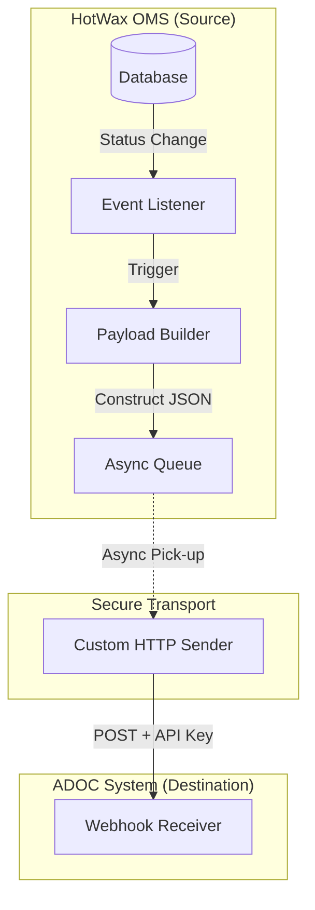
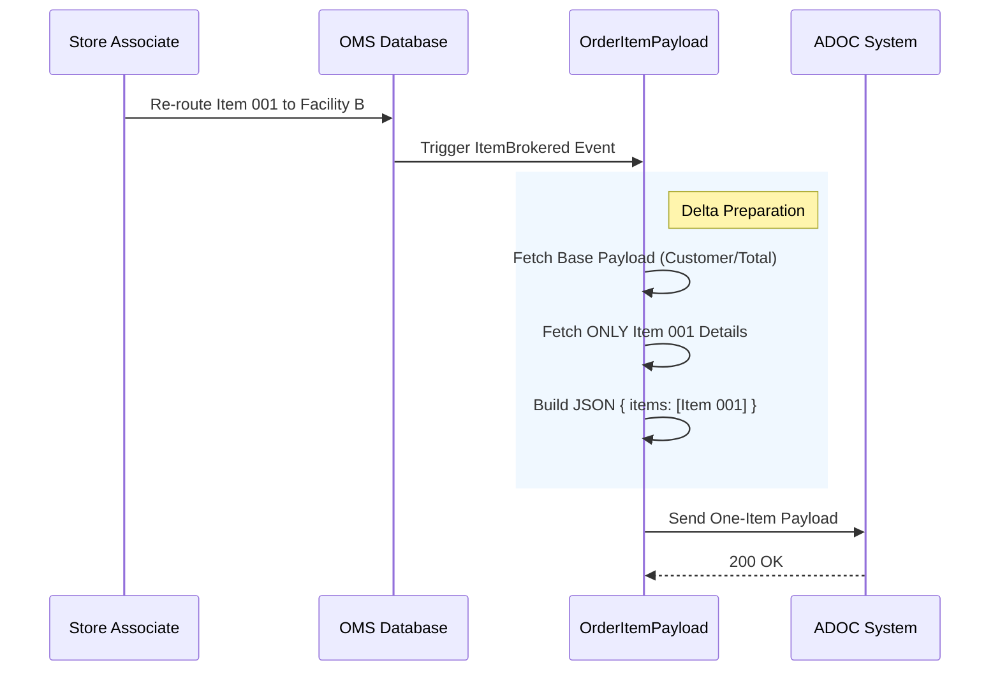
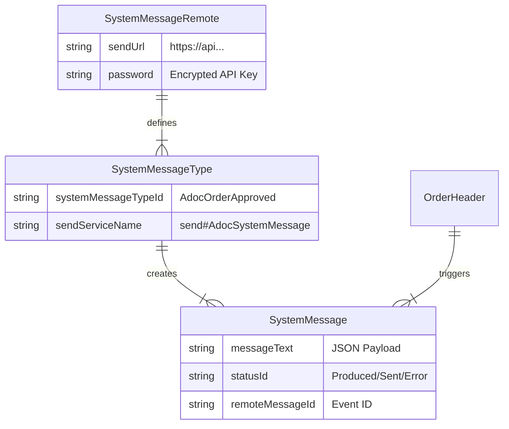

import Tabs from '@theme/Tabs';
import TabItem from '@theme/TabItem';
import WebhookSimulator from '@site/src/components/WebhookSimulator';
import Admonition from '@theme/Admonition';
import DownloadPdfWrapper from '@site/src/components/DownloadPdfWrapper';

# ADOC Webhook Integration Architecture
**Date:** 2026-02-07  
**Prepared For:** ADOC Integration Stakeholders

:::info Interactive Guide
This documentation includes interactive elements to help you understand the webhook payload structures and event flows.
:::

<DownloadPdfWrapper />

## 1. Executive Summary
This document outlines the architecture for a real-time webhook integration between **HotWax OMS** and **ADOC's Data Warehouse**. The goal is to provide ADOC with immediate visibility into order lifecycle events (Approvals, Shipments, Rejections) without impacting OMS performance.

We utilize the **Moqui SystemMessage Framework** to ensure high reliability, automatic retries, and comprehensive audit trails.

---

## 2. High-Level Architecture
The system acts as a "News Reporter," listening for key business events and dispatching JSON reports to ADOC asynchronously.

---

## 3. Core Design Decisions

### A. The "Base Payload" Pattern (Reliability & Consistency)
Every single event sent to ADOC requires a standard set of 9 contextual fields (Order Name, Brand, Price, Currency, etc.). To guarantee 100% consistency and eliminate code duplication, we implemented a **Base Payload Service**.

:::tip Business Value
Ensures that Financials and Customer Context are identical across all event types, reducing reconciliation errors.
:::

*   **How it works**: Every event service (Approved, Shipped, etc.) first calls `prepare#OrderBasePayload` to fetch the common data, then adds its specific details.

### B. Asynchronous Processing (Performance)
We invoke the webhook logic **asynchronously** via Moqui's `SystemMessage` queue.

:::note Design Decision
Do not block the user interface while waiting for ADOC's response. If ADOC is slow or down, the Warehouse Staff can continue working without interruption. The system will retry sending the message in the background.
:::

### C. Snapshot vs. Delta Strategy (Data Precision)
The ADOC API expects a uniform JSON structure, but the business meaning differs by event. We use two main strategies:

<Tabs>
  <TabItem value="snapshot" label="Full Snapshot" default>
    **Used for:** `Order Approved`, `Order Completed`
    
    Sends **ALL** items in the order. This acts as the "State of the Union" for the order.
    
    *   **Pros**: Complete picture, self-healing if previous messages were lost.
    *   **Cons**: Larger payload size.
  </TabItem>
  <TabItem value="delta" label="Delta Update">
    **Used for:** `Item Brokered`, `Item Rejected`, `Item Shipped`
    
    Sends **ONLY** the specific item(s) that changed state.
    
    *   **Pros**: Lightweight, precise tracking of individual item movements.
    *   **Cons**: Requires receiver to maintain state.
  </TabItem>
</Tabs>

### D. Idempotency & Tracing
*   **Event ID**: We map the Moqui `systemMessageId` directly to the `event_id` field in the JSON.
*   **Benefit**: This guarantees a globally unique ID for every attempt. If we retry a failed message, the ID remains the same, allowing ADOC to safely de-duplicate.

---

## 4. Security & Error Handling

### Authentication
*   **Mechanism**: API Key via `x-api-key` header.
*   **Storage**: The key is stored in the **Encrypted** `password` field of the `SystemMessageRemote` entity. It is never exposed in logs or plain text.

### Failure Recovery
*   **Scenario**: ADOC API returns `500 Error` or times out.
*   **Response**: The system marks the message as `Error`. Moqui's `SystemMessage` service automatically retries the delivery on a scheduled interval (Exponential Backoff).
*   **Alerting**: Failures are logged in `SystemMessageError` for administrator review.

---

## 5. Event Specifications & Simulator

Use the interactive simulator below to understand the JSON structure for different event types.

<WebhookSimulator />

### Detailed Triggers

Click to see detailed trigger logic

| Event | Status Change Trigger | Payload Focus |
| :--- | :--- | :--- |
| **Order Approved** | `ORDER_APPROVED` | Full Order + All Items |
| **Item Brokered** | Item Assigned to Facility | Single Item + `facility_id` |
| **Item Rejected** | Item Rejected | Single Item + `reason` |
| **Item Shipped** | Shipment `PACKED` -> `SHIPPED` | Shipped Items + `tracking_code` |
| **Order Completed** | `ORDER_COMPLETED` | Full Order (Final State) |

### Scenario 6: Item Brokered Sequence (Example)
This diagram shows the "Delta" logic where only ONE item is processed.

---

## 7. Data Model Relationship
How the System Message components interact with your Orders.

## 8. Implementation Plan Summary
1.  **Configure Environment**: Set up ADOC Remote Connection & API Key.
2.  **Develop Services**: Implement Base Payload and 4 Event-Specific Builders.
3.  **Deploy Triggers**: Activate SECA rules for live monitoring.
4.  **Verify**: End-to-End testing with Mock Endpoint.

:::success Architecture Approved
Ready for Implementation.
:::

